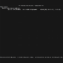
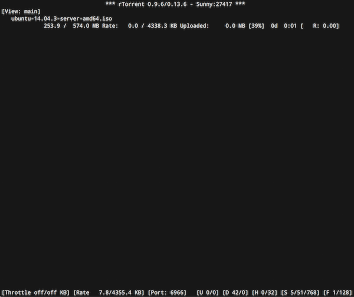

asustor-rtorrent
================

rTorrent for Asustor ADM.

A sample `rtorrent.rc` is provided in the config directory with a few pre-made choices (feel free to change them).

How to use
----------

1.	Install through App Central
2.	Log in on NAS through SSH
3.	Run `rtorrent-attach`
4.	Enjoy rTorrent!
5.	Detach with `^T` (Ctrl+T)

Configuration files are located in `/usr/local/AppCentral/rtorrent/config`.

You can restart rTorrent with `/usr/local/AppCentral/rtorrent/CONTROL/start-stop.sh restart`.

Screenshot
----------

